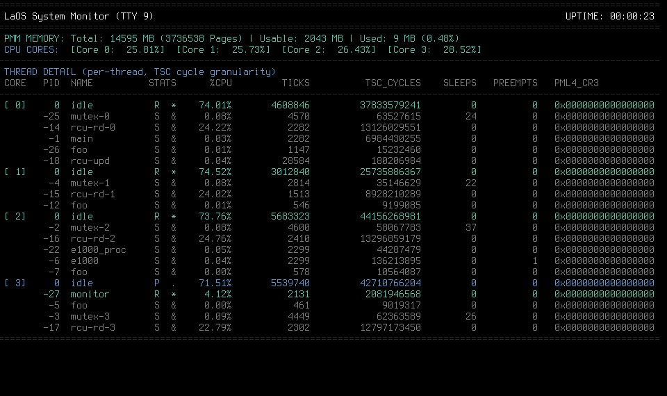

# LaOS: Lyre and Orchestra Symphony

[](https://github.com/erocpil/LaOS/actions/workflows/build.yml)



LaOS 是面向 x86_64 的多核抢占式内核原型，约 25,000 行 C 与汇编。不追求 POSIX 兼容，专注 SMP 抢占同步与 selftest 驱动的持续验证。

## Design Highlights

- **声明式任务清单**。`conf/task.conf` 以 tab 分隔的文本声明每个 CPU 应启动的模块，用户程序或内核线程，由内核解析加载，调整任务无需重编译。
- **Linux 风格模块参数**。`MODULE_PARAM(var, type, desc)` 宏生成 `__laos_params` ELF 段，内核在加载模块时匹配 task.conf 的 `key=value` 对，直接写入模块全局变量——`main()` 执行时变量已是正确值，无手写解析代码。
- **模块双向符号解析**。`.mo` 为独立 ELF，boot 时由 Limine 载入；`ksymtab` 同时支持 kernel 到 module 与 module 到 kernel 两个方向的符号解析。
- **不变量运行期自检**。PMM 初始化末尾调用 `pmm_mark_protected`，reserved 或 ACPI 区若被错误释放即 panic；kheap 释放路径以物理邻接为前提判定块合并。
- **Selftest 框架**。`@test` directive 驱动内置与 `.mo` 模块测试，支持 configure → prepare → start → tick → done → PASSED/FAILED 生命周期。CI 对 x86_64 执行基础 selftest 与 LaFS 真设备回归；仓库另提供 SMP TLB、FPU、调度压力、多用户、负向与回滚测试目标。

## Features

- **Boot**: Limine BIOS/UEFI 引导，SMP 多核启动。
- **MM**: bitmap first-fit PMM，4 级页表 per-task PML4，带邻接合并的链表 kheap；VMA 虚拟内存区域跟踪，mmap/munmap + 按需分页；页故障恢复——not-present 按需分配，权限违规/越界终止用户进程。
- **Sched**: 内核态可抢占，64 级静态优先级、同级轮转、已入队优先级迁移、睡眠唤醒，以及 mutex 单跳优先级继承（多锁 donation 聚合）。
- **RCU**: 读侧免锁，`gp_seq` / `blocked_tasks` 两阶段推进显式宽限期。
- **Module**: `main(argc, argv)` 入口，`MODULE_PARAM(int/string/bool)` 编译期声明参数，task.conf 中 `key=value` 加载期写回变量。append-only 注册表支持 FREE/RESERVED/COMMITTED 三态安全回滚。
- **Selftest**: 统一测试子系统——内置测试（priority/PI、remote enqueue、RCU publication、registry、VMA、CPIO）和 `.mo` 载荷测试（IPI, TLB, FPU），串行调度、独立 IPI vector、PASSED/FAILED 门禁集成。
- **Net**: e1000 驱动，12 路 MMIO 硬件计数器 + 软件计数器。
- **TTY**: TTY 0 为控制台，TTY 6-9 为 live monitor（CPU / NET / RCU / PMM），0.5-1 Hz 刷新。
- **User**: crt0 + syscall（mmap / munmap / write / exit / yield）+ CPIO initrd 动态加载用户程序 + `task.conf` 驱动用户态进程。
- **Storage**: virtio-pci block 轮询驱动；LaFS 只读文件系统——magic 校验、superblock、inode 链表、间接块索引、目录遍历，并提供真设备挂载回归目标。

## Build & Run

```bash
git submodule update --init --recursive
sudo ./script/setup_host_net.sh up    # 创建 tap0
make                                  # 编译,生成 build/LaOS.iso
make run                              # qemu: -smp 4 -device e1000 -netdev tap
sudo ./script/setup_host_net.sh down  # 清理 tap0
```

依赖: `gcc`、`nasm`、`xorriso`、`qemu-system-x86_64`。

## Documentation

从 [文档入口](docs/index.md) 开始。首次构建参考
[Getting Started](docs/getting-started.md)，当前能力边界以
[Current Limitations](docs/current-limitations.md) 为准。查找测试目标及其
具体方法时，从 [测试入口](docs/testing-guide.md) 开始。

## Layout

```
conf/    声明式任务清单
kernel/  内核调度，同步，页表，计数采集
  arch/x86_64/     x86_64 架构代码
module/  可加载模块（e1000、selftest 载荷）
user/    用户态运行时与测试程序
script/  宿主机脚本
docs/    教学文档（book + design + process）
```

## Known Limitations

完整、持续维护的列表见
[docs/current-limitations.md](docs/current-limitations.md)。摘要如下：

- **x86_64 中断栈隔离延后**：致命异常（#DF、NMI、#MC）使用 TSS IST 独立栈；per-CPU 中断栈已分配（8KB），但实际切换与 `switch_to` 的交互尚未处理完，暂继续复用被抢占线程的 kernel stack。
- **PMM 单一全局锁**：无 per-CPU 缓存或并发分区。
- **RCU 仅同步回收**：未提供 `call_rcu` 异步回调。
- **模块符号仅按名查找**：不校验签名版本，旧 `.mo` 载入行为未定义。
- **无 TCP/IP 协议栈**：e1000 仅到 MMIO 收发与计数器层面。
- **存储**：virtio-blk 轮询驱动 + LaFS 只读文件系统尚无写入路径。

## License

MIT License. See [LICENSE](LICENSE).
